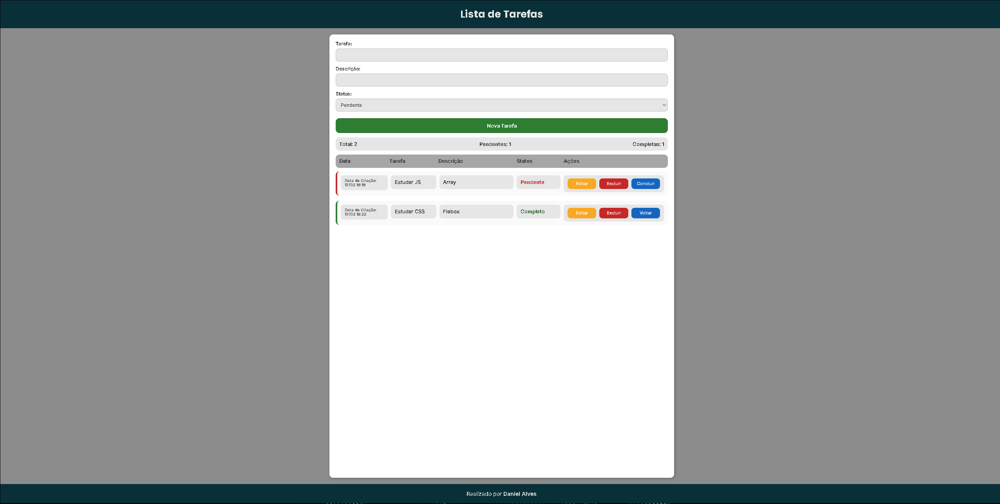
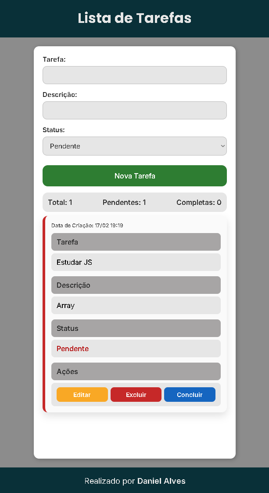

# 📝 Lista de Tarefas - JavaScript Vanilla

Aplicação de lista de tarefas desenvolvida com HTML, CSS e JavaScript puro (Vanilla JS), com foco em manipulação de DOM, organização de código e persistência de dados utilizando localStorage.

---

## 📌 Sobre o Projeto

Este projeto foi desenvolvido com o objetivo de aprofundar conhecimentos em JavaScript, especialmente:

- Manipulação dinâmica do DOM
- Delegação de eventos
- Organização e separação de responsabilidades
- Persistência de dados com localStorage
- Estruturação de funções reutilizáveis
- Controle de estado da aplicação

A aplicação permite criar, editar, excluir e marcar tarefas como concluídas, mantendo os dados salvos mesmo após recarregar a página.

---

## 🚀 Funcionalidades

- ✅ Criar novas tarefas
- ✏️ Editar tarefas através de modal
- 🗑️ Excluir tarefas
- 🔁 Alternar entre "Pendente" e "Completo"
- 📅 Registro de data e hora de criação
- 📊 Contador automático (Total, Pendentes, Completas)
- 💾 Persistência com localStorage
- 📭 Estado vazio ("Nenhuma tarefa ainda")
- 🔝 Ordenação por data (mais recentes primeiro)
- 📱 Layout responsivo

---

## 🧠 Conceitos Aplicados

- Manipulação de elementos com `createElement`
- Uso de `dataset`
- `JSON.stringify()` e `JSON.parse()`
- Delegação de eventos com `document.addEventListener`
- Uso de `closest()`
- Organização de funções como:
  - `criaTarefa`
  - `criaCampo`
  - `criaAcoes`
  - `aplicarVisualStatus`
  - `salvarTarefas`
  - `mostrarTarefa`
- Controle de estado da interface
- Uso de `classList.add`, `remove` e `toggle`
- Ordenação com `sort()`

---

## 🛠️ Tecnologias Utilizadas

- HTML5
- CSS3
- JavaScript (Vanilla)

---

## 📷 Preview

Desktop: 

Mobile:

---

## 📈 Aprendizados

Durante o desenvolvimento deste projeto, foram enfrentados desafios relacionados a:

- Organização do fluxo de execução
- Separação correta de responsabilidades entre funções
- Atualização dinâmica do estado da interface
- Sincronização entre DOM e localStorage

O projeto foi refeito do zero como exercício de consolidação, reforçando a compreensão do funcionamento completo da aplicação.

---

## 📌 Próximos Passos

- Melhorar acessibilidade
- Refatorar partes do código para maior modularização
- Evoluir para uma versão utilizando framework (ex: React)

---

Desenvolvido por Daniel Alves.